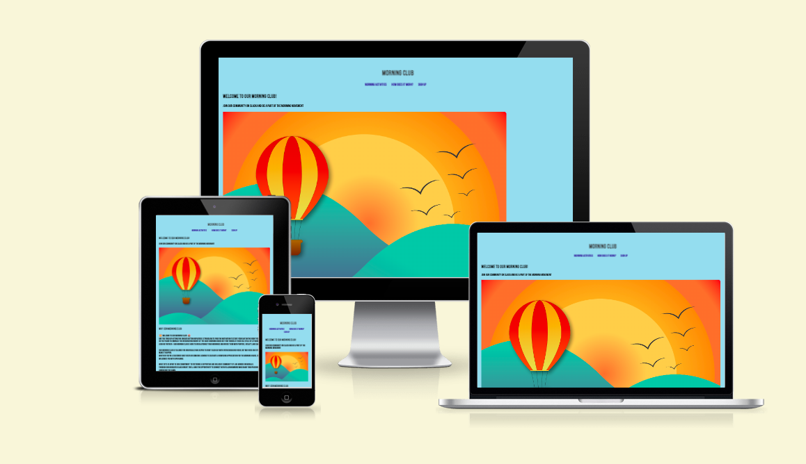
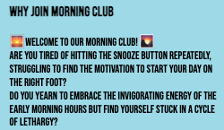
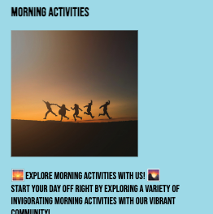
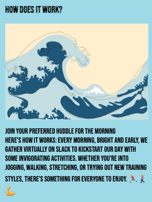
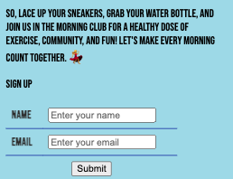
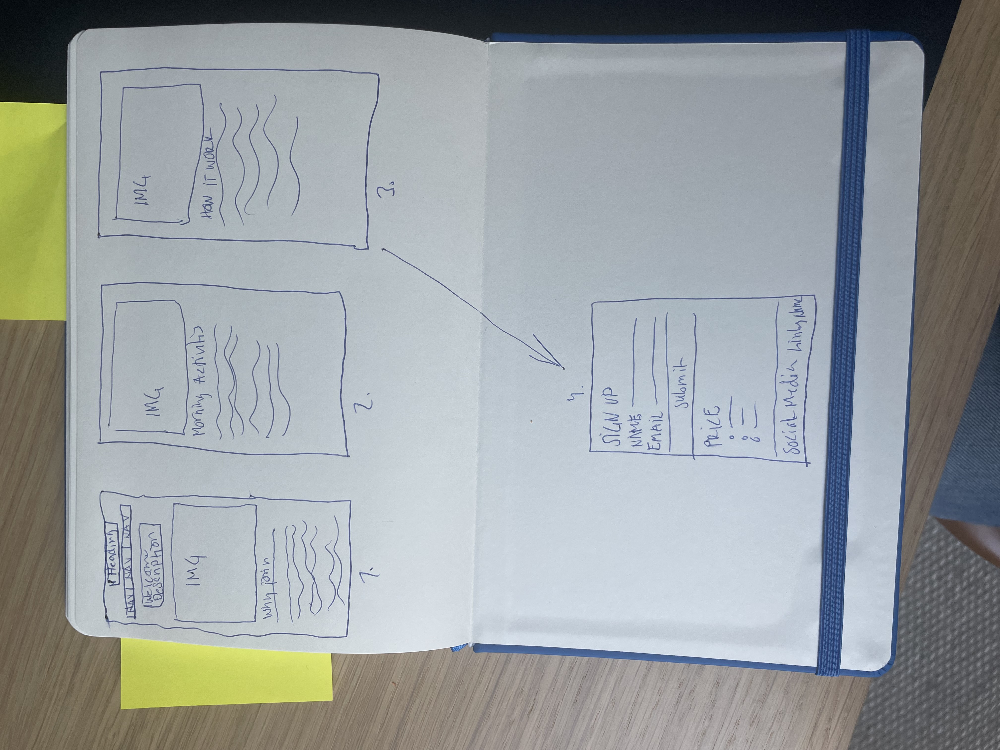
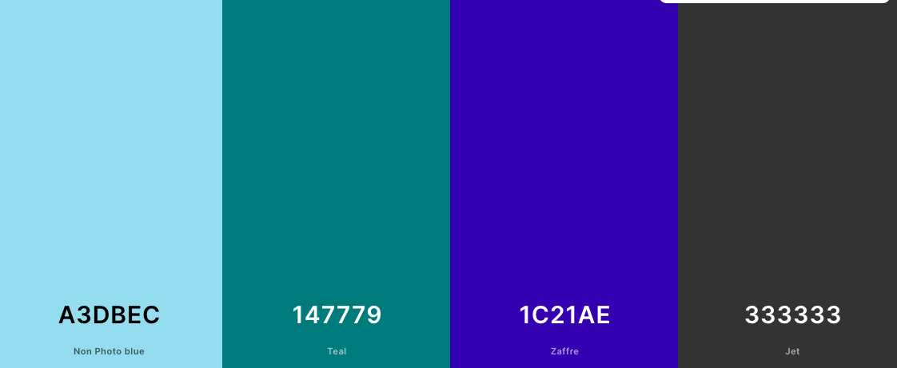

 

 ## Table of Contents
1. [About Morning Club](#about-morning-club)
2. [Navbar/Sections](#navbar-sections)
3. [Welcome Message](#welcome-message)
4. [Why Join Section](#why-join-section)
5. [Morning Activities Section](#morning-activities-section)
6. [How Does It Work Section](#how-does-it-work-section)
7. [Price Rates Section](#price-rates-section)
8. [Sign-Up Section](#sign-up-section)
9. [Footer with Social Media links](#Footer-with-Social-Media-links)
10. [UX Goals](#ux-goals)
11. [Visitor Goals](#visitor-goals)
12. [User Stories](#user-stories)
13. [Technologies Used](#technologies-used)
14. [Visual Design](#visual-design)
15. [Testing](#testing)
16. [Bugs](#bugs)
17. [Deployment](#deployment)
18. [Credits](#credits)
19. [Contact](#contact)      

## About Morning Club
- Description of Morning Club and its purpose.
- Approach to images and colors for the site.

The Morning Club webpage is designed to provide enough information about the Morning Club and its purpose for the target group. Arguments and compelling quotes are mainly through ads directed to specific target groups and organic content on social media. Since the club is not about meeting other people, I choose not to have faces in the pictures and also no pictures that symbolize different training performances. This gives the club a more secretive vibe, but the color and pictures are warm and welcoming, also giving an easy, inclusive, and simple first impression.

About Morning Club:
The Morning Club is a virtual community that gathers every morning between 6-8 AM on Slack for a morning huddle. We believe in the power of movement, the rhythm of the morning, and the joy of starting our days on an uplifting note. Our community offers encouragement, accountability, and connection to help you build a vibrant morning routine and make every morning a great start for you. It's okay to be anonymous, and we strive to create a safe place for everyone.

## Navbar/Sections
- Description of the sticky navbar and its functionality.
- Image of the navbar in action.

Instead of scrolling, you can click on the sections to reach the most relevant information. The navbar is sticky, making it easy to access different sections without scrolling through the site.

## Welcome Message
- Description of the welcome message and its purpose.
- Image of the welcome message on the site.
Welcome Message: The welcome message gives the user a direct understanding that the community is on Slack. 

## Why Join Section
- Description of the benefits of joining Morning Club.
- Image of the Why Join section.
This section explains the community and what to expect from joining the club. Whether you're a seasoned early riser or seeking a newfound appreciation for mornings, our inclusive community welcomes you. Receive support, tips, and accountability from experienced coaches, all from the comfort of your home.

## Morning Activities Section
- Description of the activities showcased in this section.
- Image of the Morning Activities section
This section showcases a variety of invigorating morning activities such as jogging, yoga, walking, exercising in place, and stretching. It provides options for individuals of all fitness levels who want to prioritize their physical and mental well-being and embraces the spirit of The Morning Club.

## How Does It Work Section
- Explanation of how Morning Club works.
- Image of the How Does It Work section.
This section explains the mechanics of joining Morning Club, including virtual gatherings on Slack and choosing huddles tailored to preferences and fitness levels, catering to individuals seeking guidance and support in establishing a consistent morning routine.

## Price Rates Section
- Description of the subscription options.
- Image of the Price Rates section.
Displays the subscription options for The Morning Club, offering flexibility with yearly, monthly, and weekly rates, accommodating individuals with varying budgets and commitment levels.

## Sign-Up Section
- Instructions for signing up and joining the club.
- Image of the Sign-Up section.
Sign up now to discover our membership options and pricing. As you reach the sign-up page and select your pricing rate, you'll have the option to join our Morning Club newsletter. This newsletter provides tips on products and other morning-relevant content, fostering collaboration with companies, affiliates, and potential sponsors to promote their brands or products.

## Footer with Social Media links
- Description of the footer and its social media links.
- Image of the footer with social links to social media
Provides links to social media platforms like Slack, Twitter, and Facebook, for Slack, you have to become a member to join, and the other channels are for marketing and sharing content.

## UX Goals
- Visitor goals and the focus of the user experience.
- Target audience for Morning Club.

Visitor Goals
The visitor is supposed to explore our platform, discover a wealth of information curated to provide you with deeper insights and resources than what you may have encountered through our ads or organic content.

Our focus here at the Morning Club is on empowering you to take control of your mornings. We understand that the way you begin your day sets the tone for everything that follows. That's why our site is dedicated to offering you tools, tips, and community support to help you craft a morning routine that aligns with your goals and values.

Whether you're looking to boost productivity, cultivate mindfulness, or simply find inspiration to make the most of your mornings, you'll find everything you need right here. From expert advice to member-shared experiences, our platform is designed to be a valuable resource on your journey towards morning bliss.

#The target audience for Morning Club are: 
People who wake up early and want to do something for their health
People who are interested in training but don't want to leave their home or go to a gym

## User Stories
- Five user stories detailing different motivations for joining The Morning Club

1. As a busy mom juggling multiple responsibilities, I want to join Morning Club to receive the support and guidance I need to establish a consistent morning routine, so I can prioritize my well-being and start each day feeling energized and focused on taking care of my family.

2. As an individual on the autism spectrum with difficulty in social settings, I want to join Morning Club to receive the social push I need to start my day with purpose and intention, so I can feel supported and included in a community of like-minded individuals despite my challenges with social interaction.

3. I'm working from home and living far from a gym, I want to join Morning Club to access virtual morning activities that I can conveniently participate in from the comfort of my own home, so I can maintain a healthy lifestyle and stay active despite my remote location.
4. Like to enjoy moving every morning but doesn't necessarily require a gym, I want to join Morning Club to explore a variety of invigorating activities like jogging, walking, yoga, and stretching, so I can start my day on a positive note and connect with a supportive community of like-minded individuals who prioritize movement and well-being.

5. As someone who feels obligated to join but doesn't want to feel pressured, I want to join Morning Club where I can choose to say "good morning" to everyone but not feel obligated to do so, knowing that by participating, I'll feel more inspired and motivated to join in the activities and connect with others in the community. This way, I can enjoy the sense of belonging and encouragement without feeling overwhelmed by expectations.

## Technologies Used
- List of languages and tools used in development.
- Wireframe image.

Languages

HTML
Page markup

CSS
Styling

Tools

Favicon Generator
https://favicon.io/on

Google fonts
https://fonts.google.com/

Paper and pen for making Wireframe
Wireframe:

Other tools
Differschecker 
https://www.diffchecker.com/

Google inspect

## Visual Design
- Explanation of the visual elements like fonts, colors, and images.
- Image of the color palette used.
Visual design 

Images
https://pixabay.com/sv/

Font family: Bebas Neue - I opted for the Bebas Neue font family as I aimed for bold, all-capitalized text, ensuring the site remains informative and easily readable.

## Testing
- Details of HTML and CSS testing.
- Lighthouse test result image
- HTML
- HTML subscribe form
No errors were returned when passing through the official W3C validator 

-CSS
No errors were found when passing through the official (Jigsaw) validator
-Friends and famliy tested on diffrent divices. 

Lighthouse 

## Bugs
- Experience with encountering and fixing bugs during development.
I encountered numerous bugs throughout the process, but with invaluable assistance from my classmates, Slack, tutors, ChatGPT, and my mentor, I was able to address them effectively. In hindsight, I realize the importance of documenting these issues before fixing them to maintain clarity and ensure I retain what I've learned, thus avoiding repetition. This experience has taught me the necessity of documenting and committing changes more frequently, in a systematic manner, and being more specific in my commit messages  

## Deployment

The site was deployed to GitHub pages. The steps taken to deploy are as follows:

Log in to Github
Navigate to  in https://github.com/RosencrantzArt/Morning-Hub
the list of repositories
In the GitHub repository, navigate to the [Settings] tab
In Settings scroll down to [GitHub pages] which opens in a new page.
From the source section drop-down menu, select the Master Branch
Once the master branch has been selected, the page is automatically refreshed and a display indicates the successful deployment and the link to the address.
The link to the live website is here: https://rosencrantzart.github.io/Morning-Hub/

## Learnings

Challenges and lessons learned from deploying the project.
Deploying and committing code has been quite the learning experience for me. Initially, I encountered some issues with the connection between Gitpod and GitHub, which caused some frustration. However, overcoming these challenges has taught me valuable lessons about version control and deployment processes.

One of the key insights I gained was the importance of thoughtful commits. At first, I believed that I needed to commit every change I made, which resulted in a cluttered history and unclear commits. Through trial and error, I learned to be more selective about what to commit, focusing on meaningful changes that align with the project's goals.

Furthermore, I realized the significance of planning and organization in the development process. Instead of diving straight into coding, I now take the time to outline my ideas and create a wireframe. This structured approach helps me visualize the project's structure and identify potential challenges before writing a single line of code.

In analogy, I used to approach coding like sorting through a box of LEGO pieces by color and shape before building. Now, I understand the value of first laying out all the pieces and then assembling them with purpose and clarity.

Searching for answers and AI-generated suggestions during the development process has presented its own set of challenges. Often, when seeking solutions or guidance online, I encountered recommendations that were not directly relevant to my project or even included programming languages unfamiliar to me.

This influx of information, while sometimes overwhelming, served as a reminder of the importance of discernment and critical thinking. I learned to sift through the noise and identify the most applicable solutions for my specific needs, rather than blindly following generic advice.

Moreover, encountering suggestions involving unfamiliar programming languages served as a humbling reminder of the vastness of the tech landscape and the continuous learning journey inherent in software development. While it can be tempting to explore new languages and technologies, I recognized the value in focusing on mastering the tools most relevant to my current project and skillset.

## Credits
- Acknowledgments to individuals and resources that contributed to the project. 
- CI students in our Swedish channel 
- CI students in our april2024 channel
- Mentor Rory Patrick 
- Loan Zaharia - CI student 
- Youtubers and many different coders on gitpod

## Contact
- Contact information for further inquiries or feedback.
Please feel free to contact me at anrosencrantz79@icloud.com 